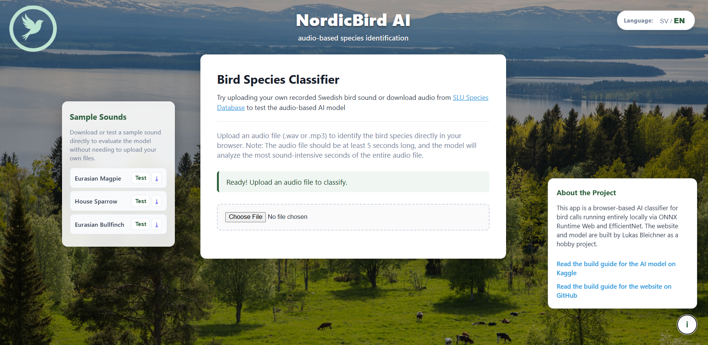

# Bird Species Classifier – Audio-Based Species Identification



An interactive web-based AI application designed to identify Swedish bird species directly from audio files (.wav, .mp3). The website performs client-side inference entirely within the user's browser, ensuring privacy and eliminating the need for external server infrastructure.

---

# Open the website down below in the links!

## Links & Resources

* [The website can be found here](https://lukasble.github.io/Swedish-Bird-Classifier/)
* [The guide on how the AI was built can be found here](https://www.kaggle.com/your-kaggle-notebook-url)
* [SLU Artbanken / Artfakta](https://artfakta.se/sok)

---

## Repository & File Structure

The project uses a clean, flat architecture to keep client-side execution fast and straightforward:

```text
.
├── audio/
│   ├── domherre.wav
│   ├── grasparv.wav
│   └── skata.wav
├── images/
│   ├── fagel.png
│   ├── logo.png
│   └── screenshot.png
├── app.js
├── index.html
├── model.onnx
├── styles.css
└── README.md
```

### Directory & File Descriptions

* index.html  
  The main entry point and visual markup of the application. The layout is divided into three primary sections: a top navigation bar with a logo and language switcher, a sidebar containing sample audio files, and a main content area housing the upload box, status indicator, bird media preview, and dynamic chart container. External dependencies (onnxruntime-web, Chart.js, Meyda) are loaded via CDN.

* app.js  
  Handles all core application logic, digital signal processing (DSP), and AI inference execution:
  - Model Initialization: Loads model.onnx into the browser via ONNX Runtime Web.
  - Audio Analysis: Parses uploaded or sample files via the Web Audio API (AudioContext) to isolate the most audio-intensive seconds. This dynamic segment selection improves real-world classification accuracy compared to the fixed 5-second middle window used during model training on noisier dataset audio.
  - Feature Extraction: Transforms isolated audio frames into mel-spectrogram representations using Meyda.
  - Inference & Softmax: Passes spectrogram tensors into the ONNX session, computes prediction probabilities using a Softmax function, and updates the UI and chart elements.
  - Localization: Dynamically swaps all text labels between Swedish and English in real time without page reloads.

* styles.css  
  Contains all styling and layout properties. Built using CSS Grid and Flexbox to ensure responsive design across desktop and mobile devices, along with styled buttons, card containers, shadows, and custom typography.

* model.onnx  
  The trained deep learning model (based on an EfficientNet architecture) exported to ONNX format. Runs locally inside the browser using WebAssembly/WebGL to classify audio spectrograms.

* audio/  
  Directory containing pre-loaded test audio files in .wav format (e.g., domherre.wav, grasparv.wav, skata.wav). Enables instant testing from the sidebar without requiring user uploads.

* images/  
  Stores static visual assets, including the main application logo (logo.png), placeholder/species artwork (fagel.png), and the application screenshot (screenshot.png).

---

## Technical Processing Pipeline

1. Initialization: index.html loads in the browser and app.js initializes the ONNX Runtime Web session with model.onnx.
2. Input Handling: The user uploads an audio file (.mp3/.wav) or selects a sample file from the audio/ directory.
3. Signal Processing: app.js decodes the audio stream, identifies the segment with the highest audio intensity, and constructs a mel-spectrogram using Meyda.
4. AI Inference: The spectrogram tensor is passed to model.onnx directly within the browser engine.
5. Presentation: Results are rendered in index.html by updating the top predicted species name, rendering the corresponding image from images/, and plotting probability metrics with Chart.js.

---

## Local Development Setup

Because the application is entirely client-side, no database or backend server configuration is required.

1. Clone the repository:
   git clone https://github.com/your-username/bird-species-classifier.git
   cd bird-species-classifier

2. Run locally:
   Open index.html directly in any modern web browser or serve the directory using a local static server (e.g., Live Server extension in VS Code or npx serve).

---

## Links & Resources

* [The website can be found here](https://your-website-url.com)
* [The guide on how the AI was built can be found here](https://www.kaggle.com/your-kaggle-notebook-url)
* [SLU Artbanken / Artfakta](https://artfakta.se/sok)